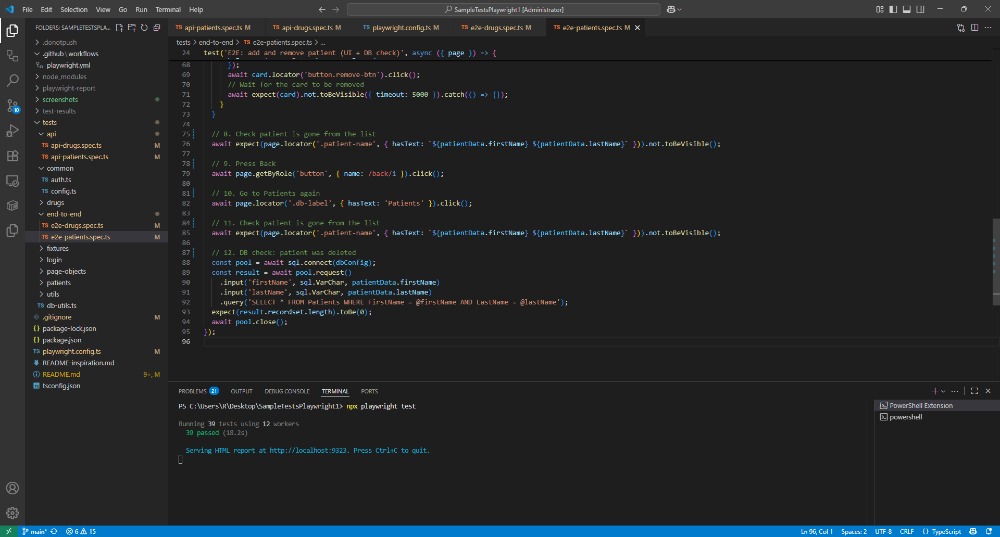
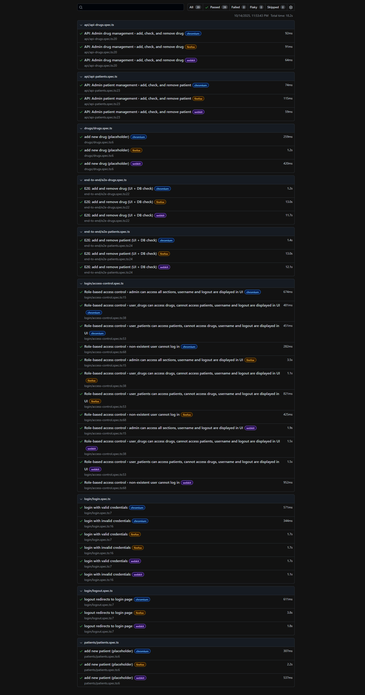
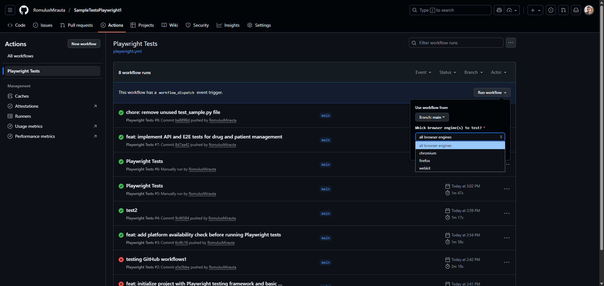

<h1 align="center">
Sample Test Automation<br>Playwright + JavaScript/TypeScript + SQL
</h1>


<p align="center">
A sample healthcare test automation project using Playwright for End-to-End, API and multi-browser Compatibility testing, with SQL Server integration.<br>This project demonstrates automated UI and API tests for a healthcare platform with user authentication, role-based access, and management of patients and drugs.
</p>

<br>

<h2 align="left">
Table of Contents
</h2>

- [I. Project Overview](#i-project-overview)
- [II. Main Features](#ii-main-features)
- [III. Prerequisites](#iii-prerequisites)
- [IV. Setup](#iv-setup)
- [V. Running Tests](#v-running-tests)
- [VI. Notes](#vi-notes)
  - [Environment variables / secrets](#environment-variables--secrets)
- [VII. CI Integration](#vii-ci-integration)
- [VIII. Main Technologies Used](#viii-main-technologies-used)
- [IX. SW Info](#ix-sw-info)
- [X. Screenshots](#x-screenshots)
  - [Playwright in Visual Studio Code](#playwright-in-visual-studio-code)
  - [Playwright HTML Report](#playwright-html-report)
  - [GitHub Actions - CI Integration - Workflow Example](#github-actions---ci-integration---workflow-example)

<br>

## I. Project Overview

This repository contains Playwright-based test automation for a sample healthcare platform. The platform includes:

- User authentication (login/logout)
- Role-based dashboards (admin, patients, drugs)
- Patients and drugs management (CRUD)
- Modern, responsive UI
- REST API endpoints for all main entities

The tests cover both UI and API functionality, and include database validation using direct SQL queries.

The Test Object is available here: [SampleTestObject1](https://github.com/RomulusMirauta/SampleTestObject1).

This project was developed as a sample for healthcare platform test automation. It was inspired by full-stack healthcare platform projects and built with the help of GitHub Copilot  (model GPT-4.1).

<br>

## II. Main Features

- **End-to-End Testing:** Automated UI tests for login, dashboard, patients, and drugs pages, simulating real user interactions.
- **API Testing:** Automated tests for all main API endpoints (patients, drugs) to ensure backend reliability.
- **Compatibility Testing:** Tests can be run across multiple browsers and browser engines (Chromium, Firefox, WebKit) for maximum compatibility. Playwright supports running the same tests on different browsers to ensure cross-browser reliability.
- **Database Validation:** Direct SQL Server queries to validate data integrity after UI/API actions.
- **Role-Based Access Checks:** Ensures users only see and interact with features allowed by their role.
- **Parallel Execution:** Playwright can run tests in parallel using multiple workers, significantly speeding up test execution. The number of workers can be configured in `playwright.config.ts` (e.g., `workers: 4`).
- **Modern Test Structure:** Uses Playwright fixtures and page objects for maintainable, scalable tests.
- **CI Integration:** Automated test runs with GitHub Actions.

<br>

## III. Prerequisites

- Node.js (v16+ recommended)
- npm
- Microsoft SQL Server (or compatible)

<br>

## IV. Setup

1. Install dependencies:

   ```sh
   npm install
   ```

2. Configure your database connection in `tests/db-utils.ts` (update user, password, server, and database as needed).

<br>

## V. Running Tests

- Run all tests:

  ```sh
  npx playwright test
  ```

- Run a specific test:

  ```sh
  npx playwright test tests/end-to-end/e2e-drugs.spec.ts
  ```

<br>

## VI. Notes

- Use `tests/db-utils.ts` to query your SQL database in tests.
- Add more `.spec.ts` files in the `tests/` folder for additional test cases.
- Test data and credentials are for demonstration only. Do not use in production!

### Environment variables / secrets

The tests read sensitive values from environment variables. Set these in your shell or CI secrets before running tests.

- DB: `DB_USER`, `DB_PASSWORD`, `DB_SERVER`, `DB_NAME`
- Test credentials: `TEST_ADMIN_USERNAME`, `TEST_ADMIN_PASSWORD`, `TEST_USER_DRUGS_USERNAME`, `TEST_USER_DRUGS_PASSWORD`, `TEST_USER_PATIENTS_USERNAME`, `TEST_USER_PATIENTS_PASSWORD`
- Optional: `BASE_URL`, `PW_WORKERS`

Example (PowerShell):

```powershell
$env:DB_PASSWORD = 'your-db-password';
$env:TEST_ADMIN_PASSWORD = 'your-admin-password';
npx playwright test
```

<br>

## VII. CI Integration

This project includes GitHub Actions integration for automated test runs. See the `.github/workflows/playwright.yml` file for details.

<br>

## VIII. Main Technologies Used

- **Playwright**: Test runner and automation framework for UI, API, and compatibility testing (see all test files in `tests/` and config in `playwright.config.ts`).
- **Node.js**: JavaScript runtime environment for running Playwright tests and scripts (project root, all test execution).
- **TypeScript**: Main language for test code, providing type safety and modern JavaScript features (all `.ts` files in `tests/`).
- **Microsoft SQL Server**: Database used for backend data storage and validation in tests (queried directly in test files like `db-utils.ts` and end-to-end specs).

<br>

## IX. SW Info

- **Platform:** Runs locally on Windows (tested with PowerShell and Node.js)
- **Database:** MS SQL Server, SQL Server 2022 Configuration Manager, SQL Server Management Studio 21, Azure Data Studio
- **Code Editor:** Visual Studio Code
- **Browsers:** Google Chrome (Chromium), Mozilla Firefox (Firefox), Safari (WebKit)

<br>

## X. Screenshots

### Playwright in Visual Studio Code



### Playwright HTML Report



### GitHub Actions - CI Integration - Workflow Example


